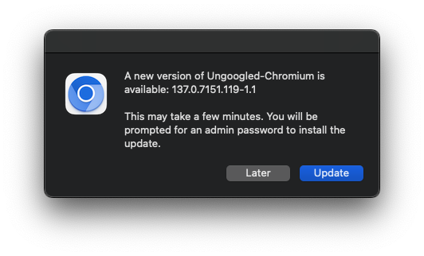
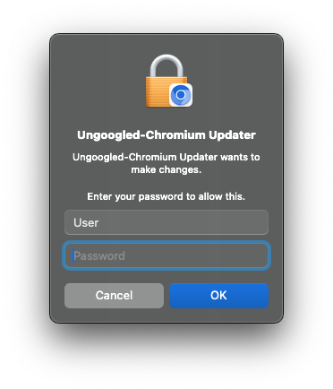
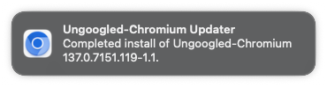

# Ungoogled-Chromium-Updater

A simple automator for updating Ungoogled-Chromium on macOS.

The automation checks for the latest version from the [ungoogled-chromium-macos repo](https://github.com/ungoogled-software/ungoogled-chromium-macos) every 24 hours and updates the app if a new release is available.
This application is architecture agnostic, so it will work on both Intel and Apple Silicon without modification.

## Clone the repo
```
git clone https://github.com/paulscalise1/Ungoogled-Chromium-Updater.git
```

## Install the application
Change directory into this repo.
```
cd Ungoogled-Chromium-Updater
```
Then run the install script.
```
chmod +x install.sh
./install.sh
```
The install script will compile the AppleScript into an application and adds a LaunchAgent that will trigger every 24 hours, running the updater.

## Usage
When the app detects a new release is available you will see a dialouge prompt:



Once 'Update' is selected, the new version is downloaded in the background and installed. You will be asked for your admin password in order to install into /Applications as seen here:



Once installed, a notification will appear:




### Note
As with any script sourced from the internet, it’s wise to review its contents priot to running it. :D
